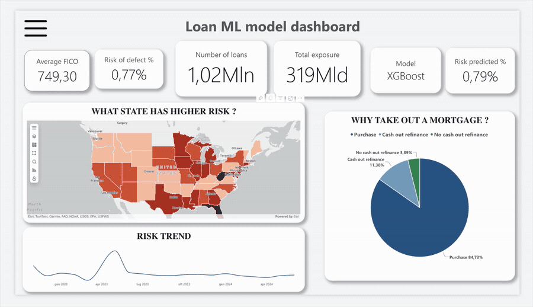
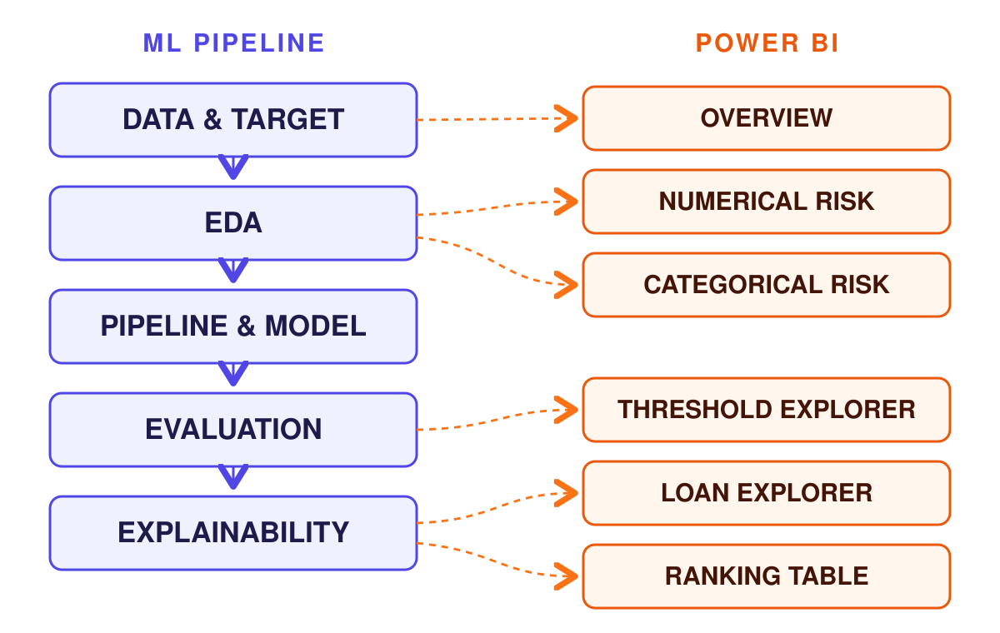
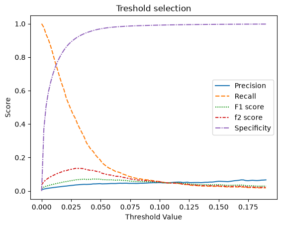
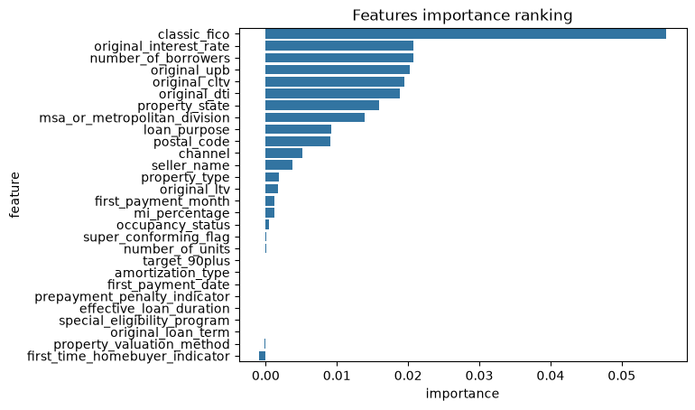
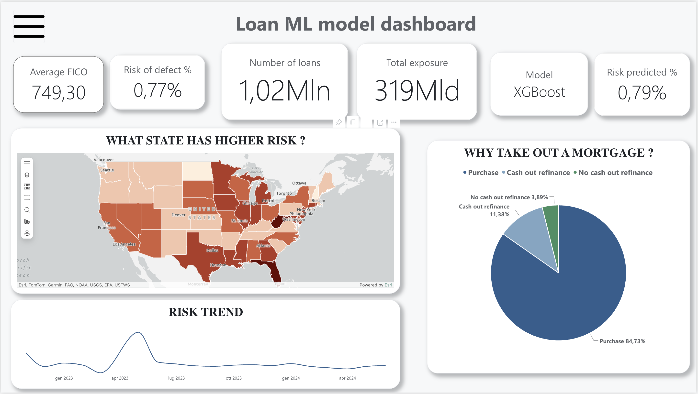
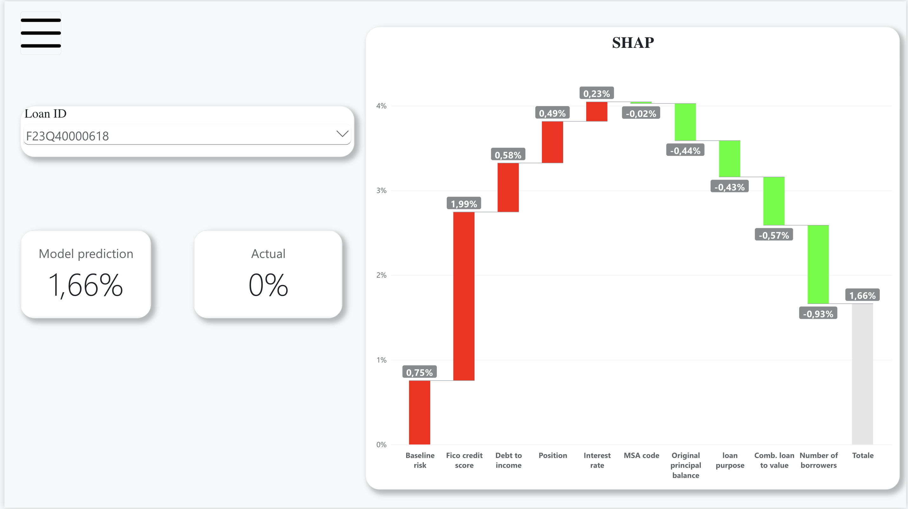

# Mortgage Default Prediction — Freddie Mac Loan-Level Data

Predicting whether a newly originated US mortgage will be **90+ days delinquent
at loan age 20 months**, using only information available at origination — then
explaining every prediction loan by loan in an interactive dashboard.




---

## How it works

Four things the notebook produces, six pages that expose them. Nothing in the
report is decorative — each panel exists because a step of the model produced
something worth showing.



---

## Skills applied

- **End-to-end ML pipeline** — 1M+ loans, 4 GB of raw data
- **Extreme class imbalance** — 0.77% default rate, F2-tuned threshold
- **Leakage-safe validation** — chronological split, calibrated probabilities
- **Explainable AI** — SHAP attribution for every single loan
- **Interactive Power BI dashboard** — 6 pages built on the model output
- **Tools** — Python, scikit-learn, XGBoost, SHAP, Power BI

---

## Results at a glance

| | |
|---|---|
| **ROC-AUC** | **0.831** on a held-out quarter |
| **Average precision** | **0.032 — 4.27x** the 0.76% base rate |
| **Recall at operating threshold** | **43.5%** of all defaults caught by flagging **9.1%** of the book |
| **Calibration** | **0.79%** predicted vs **0.77%** actual default rate |

That last line is the one worth pausing on: the model's output can be read as a
real probability, not just a risk ranking — which is what makes the per-loan
dashboard meaningful.

## The problem

A lender sees a loan application and must decide before any payment is ever
made. Can origination data alone — credit score, leverage, income ratio,
location, purpose — identify which loans will be in serious trouble within two
years?

It is a hard question by construction. Only **0.77%** of loans go 90+ days
delinquent by month 20, so a model that predicts "everyone pays" is 99.2%
accurate and completely useless. Every design decision in this project follows
from that single number.

## Data

Freddie Mac **Single-Family Loan-Level Dataset** (Standard), five quarterly
vintages from **2022 Q4 to 2024 Q1**: 1,183,107 originated loans, of which
**1,022,886** carry a month-20 label and **7,916** are positive.

The raw files are ~4 GB and licence-restricted, so they are not in this repo.
[`data/README.md`](data/README.md) has the download link and the exact folder
layout the notebook expects.

## Approach

The pipeline in detail is in [`docs/05`](docs/05-preprocessing-pipeline.md).
Four decisions worth calling out:

- **The split is by time, not random.** Loans from one quarter share a rate
  environment and underwriting standard; scattering them across train and test
  would let the model see its own future and report a score that never survives
  deployment.
- **Target encoding is cross-fitted.** Replacing 20,000 ZIP codes with their own
  default rate is the obvious move and the obvious way to leak. Each row's
  encoding is computed from folds that exclude it, and rare levels are shrunk
  toward the global mean.
- **The threshold is chosen, not defaulted.** At a 0.77% base rate nothing is
  ever predicted above 0.5. F2 is the criterion because missing a default costs
  far more than reviewing a good loan.
- **No resampling or class weighting.** The imbalance is handled through metrics
  and thresholding instead, which keeps the output probabilities calibrated —
  the property the dashboard depends on.

## Results

XGBoost against three alternatives on the same pipeline, validation quarter:

| | Baseline | Logistic Regression | Decision Tree | Random Forest | **XGBoost** |
|---|---|---|---|---|---|
| ROC-AUC | 0.500 | 0.821 | 0.580 | 0.806 | **0.827** |
| Average Precision | 0.008 | 0.033 | 0.012 | 0.029 | **0.035** |
| Brier Score | 0.498 | 0.008 | 0.021 | 0.008 | **0.008** |

On the held-out test quarter the final model reaches **ROC-AUC 0.831** and
**average precision 0.032** against a 0.76% prevalence.

| | |
|---|---|
|  |  |

*Left: precision and recall trade off sharply — F2 peaks at a threshold of
0.0285. Right: FICO is worth more than the next three features combined.*

At that threshold the model flags 9.1% of the book and that queue contains
**43.5% of all loans that will default** — a 4.8x concentration against the
portfolio average. Full confusion matrix and discussion in
[`docs/08`](docs/08-final-model-and-threshold.md).

## Interactive dashboard

Six pages in Power BI, built on per-loan SHAP exports: portfolio KPIs and
geographic risk, a risk calculator for any feature, a threshold explorer whose
confusion matrix recomputes live, and a per-loan waterfall showing exactly which
features drove each prediction.

| | |
|---|---|
|  |  |

The `.pbix` is ~99 MB and stays out of the repo — see
[`docs/10`](docs/10-dashboard.md) for all six pages and how to rebuild it.

## Repository structure

```
├── final_model.ipynb      full analysis: data → EDA → model → SHAP exports
├── docs/                  section-by-section walkthrough (12 files)
├── data/README.md         how to obtain the dataset and where to put it
├── assets/img/            figures and dashboard screenshots
├── requirements.txt       pip dependencies
└── environment.yml        conda alternative (easier for XGBoost on macOS)
```

## Running it yourself

```bash
git clone https://github.com/luke235422/Freddie-Mac-ML-progect.git
cd Freddie-Mac-ML-progect
conda env create -f environment.yml && conda activate ml-env   # or: pip install -r requirements.txt
```

Then download the data per [`data/README.md`](data/README.md) and run
`final_model.ipynb` top to bottom. Loading all five quarters of performance data
needs roughly 16 GB of RAM; the last cells write the SHAP exports that feed the
dashboard.

## Documentation

| | | | |
|---|---|---|---|
| [01 Data & target](docs/01-data-and-target.md) | [04 Validation](docs/04-validation-framework.md) | [07 Selection & tuning](docs/07-feature-selection-and-tuning.md) | [10 Dashboard](docs/10-dashboard.md) |
| [02 Cleaning](docs/02-cleaning-and-features.md) | [05 Pipeline](docs/05-preprocessing-pipeline.md) | [08 Final model](docs/08-final-model-and-threshold.md) | [11 Limitations](docs/11-limitations.md) |
| [03 EDA](docs/03-eda.md) | [06 Model selection](docs/06-model-selection.md) | [09 Explainability](docs/09-explainability.md) | |

## What I'd do differently

- **The threshold is tuned on the test set**, which makes the reported F2 mildly
  optimistic. ROC-AUC and average precision are unaffected — they need no
  threshold — but the clean protocol picks the cut-off on validation first.
- **One split gives one estimate with no error bar.** Rolling-origin validation
  across the five vintages would show how stable that 0.831 actually is.


## License

MIT — see [LICENSE](LICENSE). Covers the code and documentation only; the
Freddie Mac dataset is distributed under its own terms and is not redistributed
here.
