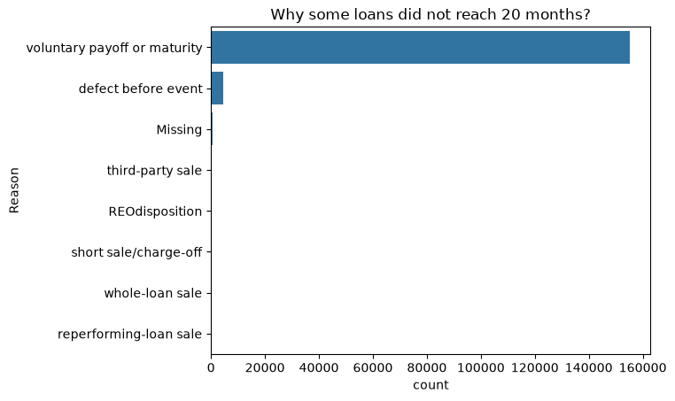

# 01 — Data and target definition

## Source

Freddie Mac **Single-Family Loan-Level Dataset** (Standard), five quarterly
vintages: **2022 Q4, 2023 Q2, 2023 Q3, 2023 Q4, 2024 Q1**. See
[`data/README.md`](../data/README.md) for how to obtain the files and where to
put them.

Two file types per quarter, both pipe-delimited with no header row:

- **Origination** (`orig_*.txt`) — one row per loan, everything known at the
  moment the loan is made: credit score, LTV, DTI, balance, rate, channel,
  property location and type, seller, and so on. 31 fields.
- **Performance** (`perf_*.txt`) — one row per loan per month, tracking
  delinquency status, current balance, rate, and any termination event. 50+
  fields.

The two are joined on `loan_identifier`. The notebook asserts that
`loan_identifier` is unique in the origination frame, which makes the join a
validated many-to-one.

## Building the target

The question is deliberately a **credit underwriting** one: using only what is
known at origination, will this loan go seriously delinquent within the first
20 months?

Steps:

1. **Compute a reliable loan age.** Rather than trust the `loan_age` field, the
   notebook derives `original_loan_age` from the dates — the month difference
   between the performance record's `period` and the loan's `first_payment_date`,
   plus one. Both are parsed from `YYYYMM`.
2. **Take one snapshot per loan**, the performance row where
   `original_loan_age == 20`. Loans with no such row have no label and drop out.
3. **Normalise the status string.** `current_loan_delinquency_status` is a mix
   of zero-padded numbers ("00", "01", …) and letter codes; it is upper-cased,
   stripped, and numeric values are zero-filled to two digits.
4. **Binarise.**

   ```
   target_90plus = 1  if  numeric status >= 3   (90+ days past due)
                          or status == "RA"     (reperforming after assistance)
                   else 0
   ```

   The 20-month horizon is a compromise: long enough that early-payment
   defaults have time to appear, short enough that the most recent vintages
   still have a complete observation window.

## Coverage

| | Loans |
|---|---|
| Originated in the five quarters | **1,183,107** |
| With a month-20 observation (labelled) | **1,022,886** |
| Dropped — never reach month 20 | **160,221** (13.54%) |

Of the labelled loans, **7,916 are positive** and 1,014,970 negative — a base
rate of **0.774%**. That single number drives every later decision: accuracy is
meaningless here (predicting "never delinquent" scores 99.2%), so the notebook
evaluates on ROC-AUC, average precision and Brier score, and picks an operating
threshold explicitly.

## Is dropping 13.5% of loans a problem?

Losing an eighth of the data matters only if the lost loans are systematically
riskier — that would bias the target downwards. The notebook checks this rather
than assuming it, which is the most valuable piece of analysis in the section.

For every excluded loan it takes the **last** performance row and reads the
`zero_balance_code`, i.e. how the loan left the data:

| Reason loan left before month 20 | Loans | Share of excluded |
|---|---|---|
| Voluntary payoff or maturity | 155,049 | 96.77% |
| Defect before event | 4,521 | 2.82% |
| Missing | 546 | 0.34% |
| Third-party sale | 53 | 0.03% |
| REO disposition | 32 | 0.02% |
| Short sale / charge-off | 18 | 0.01% |
| Whole-loan sale | 1 | — |
| Reperforming-loan sale | 1 | — |



*Reasons the 160,221 excluded loans left the data before month 20. The scale
makes the point on its own: voluntary payoff dwarfs everything else, and the
default-like exits are invisible at this resolution.*

Grouping those into outcomes:

- **Non-default exits** (payoff, maturity, reperforming sale): 155,050 loans,
  **96.77%** of exclusions — refinancing and selling the house, not distress.
- **Uncertain** (defect before event, missing): 5,067 loans, **3.16%**.
- **Default-like exits** (third-party sale, REO disposition, short sale /
  charge-off): **103 loans, 0.064%** of exclusions and about **0.01%** of all
  originations.

So the censoring is overwhelmingly benign, and at most ~103 true defaults are
missing from a positive class of 7,916 — under 1.3% of it, and too few to move
any metric reported later.

As a second check, origination characteristics are compared between labelled
and unlabelled loans:

| Feature | Unlabelled (mean) | Labelled (mean) |
|---|---|---|
| FICO | 758.2 | 752.0 |
| Original DTI | 38.05 | 38.16 |
| Original LTV | 71.06 | 76.22 |
| Original interest rate | 7.04 | 6.68 |

Close on credit quality and DTI. The gap in LTV and rate is the expected
signature of **refinancing**: loans that prepay early tend to be lower-LTV
borrowers with higher-rate loans, exactly the ones with an incentive to
refinance. That is a selection on prepayment behaviour, not on default risk,
and the notebook proceeds on that basis.
