# 03 — Exploratory analysis

The EDA runs on a copy of the modelling frame, so nothing explored here leaks
back into the data used for training.

## The imbalance dominates everything

| | Count | Share |
|---|---|---|
| Not 90+ delinquent at month 20 | 1,014,970 | 99.226% |
| 90+ delinquent at month 20 | 7,916 | **0.774%** |

One positive per 129 loans. Consequences adopted for the rest of the project:

- **Accuracy is not used.** Always predicting "good loan" scores 99.2%.
- **Average precision** becomes the primary metric, with **ROC-AUC** for
  ranking quality and **Brier score** for probability calibration.
- The decision threshold is chosen explicitly rather than left at 0.5 — see
  [08](08-final-model-and-threshold.md).

## Risk ratios rather than raw rates

Because the base rate is so low, raw default rates per category are all tiny
and hard to compare. The notebook divides by the global rate instead:

```
risk(category) = P(default | category) / 0.00774
```

A value of 2 means twice the average risk. Categorical fields with 10 or fewer
levels are plotted only when some level exceeds 1.2x or falls below 0.8x, which
keeps the output to the features that actually separate. Numerical features get
the same treatment after being cut into 7 quantile bins, which shows the
**shape** of each relationship — FICO in particular is strongly monotone, with
the lowest bucket carrying many times the average risk.

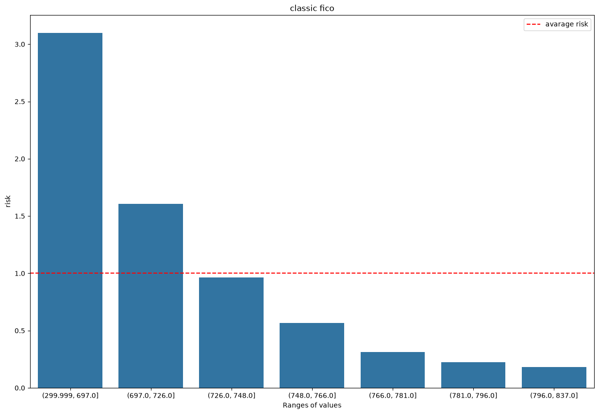

*FICO, in 7 quantile buckets. The lowest bucket (300–697) carries **3.1x** the
average risk, the highest (796–837) about **0.2x** — a 15-fold spread across the
credit spectrum, and monotone the whole way down.*

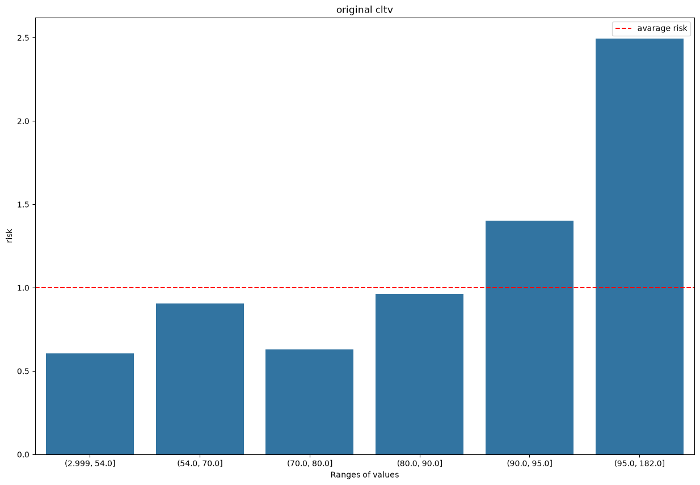
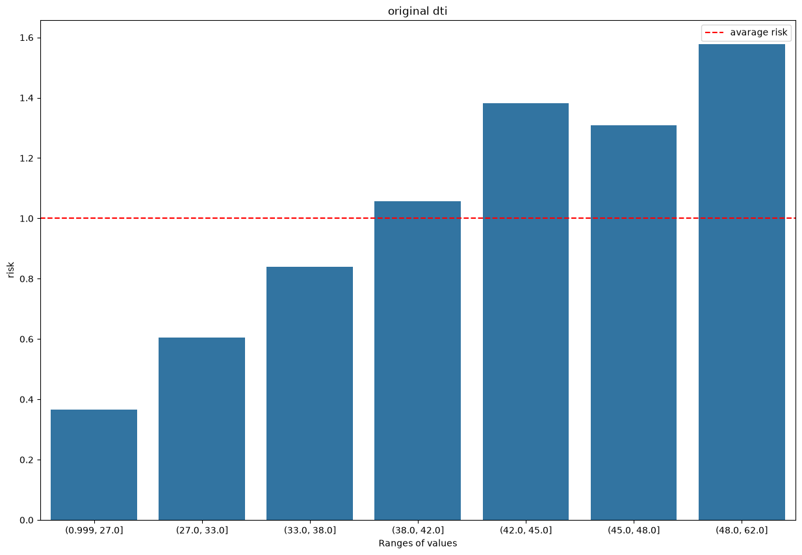

*Leverage and affordability behave as expected. CLTV is flat until 90 and then
jumps — loans above 95% CLTV run at **2.5x** average risk. DTI climbs steadily,
crossing the average line right around 38–42 and reaching **1.6x** at 48+.*

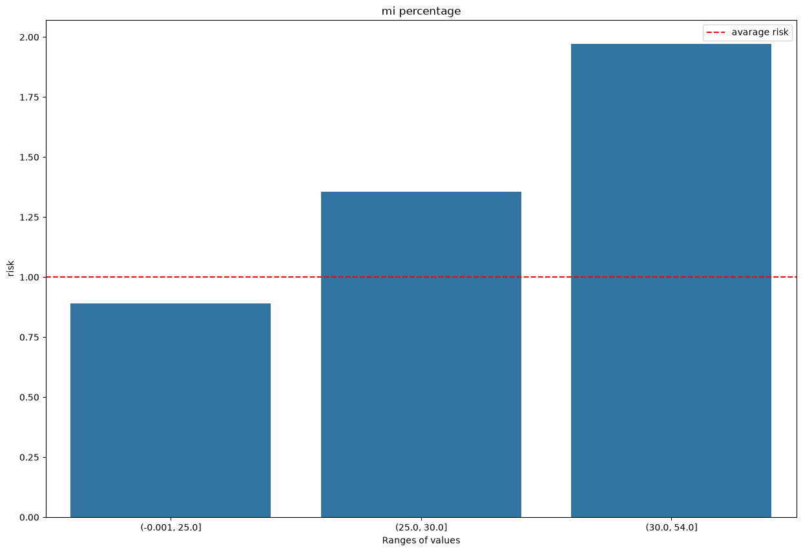

*Mortgage insurance percentage — a direct consequence of high LTV, and it
carries the same signal at **2.0x** for the top band.*

Categorical fields tell a more mixed story:

| | |
|---|---|
| 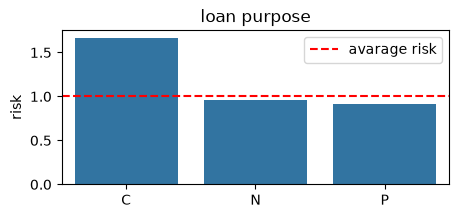 | 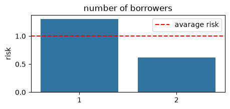 |
| 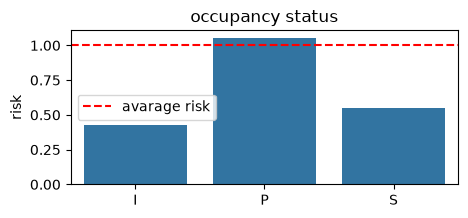 | 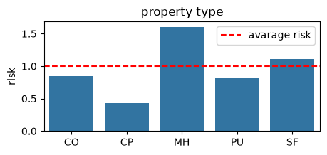 |

*Cash-out refinances (C) run at **1.7x** average risk against 0.9x for purchases.
Single-borrower loans at **1.35x** against 0.6x for two borrowers — the single
strongest categorical split in the data, and both of these survive feature
selection later. Investment properties (I) and second homes (S) are actually
**safer** than primary residences (P), which is counter-intuitive until you
remember these borrowers are screened more strictly. Manufactured housing (MH)
is the riskiest property type at 1.6x.*

Not every feature separates, and the plots show that too:

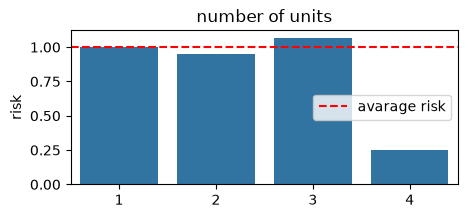

*One-, two- and three-unit properties sit on the average line within a few
percent. Only the four-unit bucket moves, and it holds too few loans to trust.
`number_of_units` is dropped by feature selection later, and this is why.*

## Missingness carries signal

For every column, the default rate among rows where that column is missing is
compared with the global rate. Several fields — DTI and FICO above all — show a
**higher than average** default rate when absent. Missing data is not random
here; an incomplete file is itself a mild risk marker.

This finding is acted upon: the pipeline creates explicit
`dti_was_missing` and `fico_score_was_missing` indicator columns
([05](05-preprocessing-pipeline.md)) so the information survives imputation.

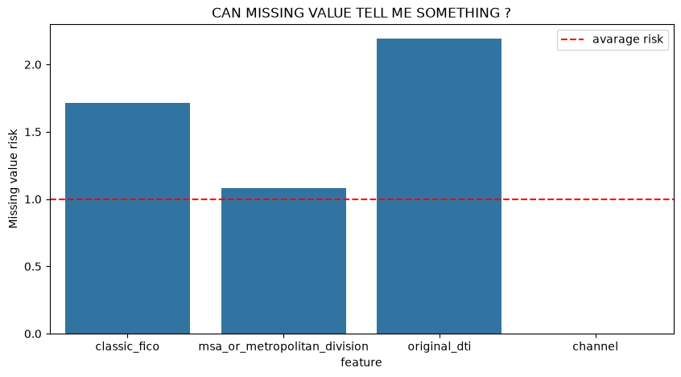

*A missing DTI marks a loan at **2.2x** average risk, a missing FICO at
**1.7x**. Not noise — a signal worth as much as most of the observed features.*

## Which features relate to the target

Two measures, matched to the data type:

- **Mutual information** for categoricals. Geography leads —
  `postal_code`, `msa_or_metropolitan_division`, `property_state` — followed by
  `seller_name`.
- **Absolute correlation** for numericals, where `classic_fico` dominates,
  ahead of `original_cltv`, `original_dti` and `original_interest_rate`.

Mutual information is the right tool for the categoricals because it detects any
dependency, including non-monotone ones, which correlation would miss.

| | |
|---|---|
| 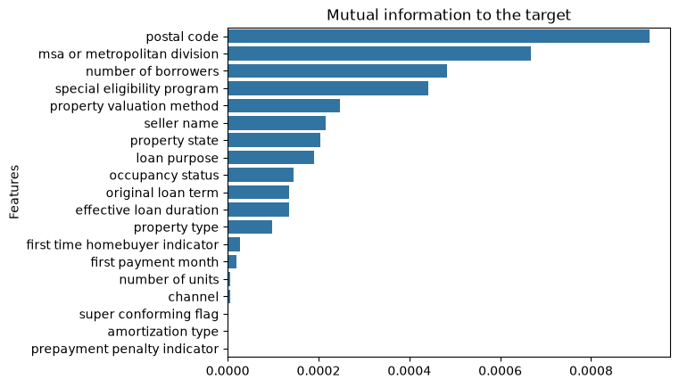 | 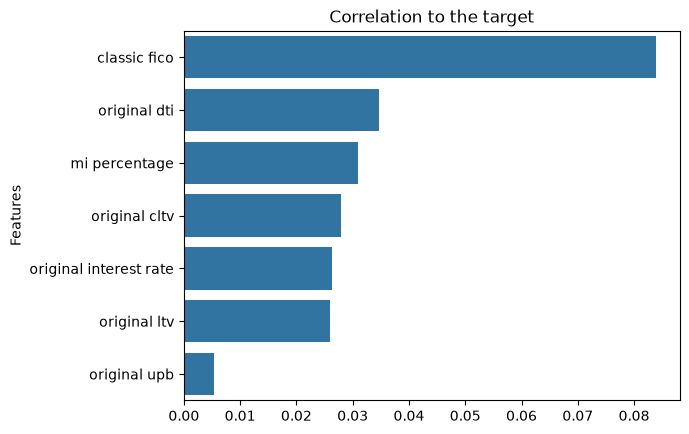 |

*Left: geography (postal code, MSA) and number of borrowers lead the
categoricals. Right: FICO's correlation with the target is roughly 2.5x that of
the next numerical feature — the same dominance permutation importance confirms
in [09](09-explainability.md).*

## Engineered features, tested before use

Three candidates were built from the existing fields and judged on whether they
correlate with the target more than the originals do:

| Candidate | Definition | Idea |
|---|---|---|
| `property_value` | `original_ltv / original_upb` | Reconstruct the appraised value implied by the LTV ratio |
| `All_known_morgage` | `original_cltv * property_value` | Total secured debt on the property, including junior liens |
| `% value requested` | `original_upb / property_value` | Share of property value borrowed |

Plotted against the original numerical features and colour-coded
original-versus-engineered, the first two held up and were kept in the pipeline;
the third was dropped. Testing engineered features against a baseline before
adopting them is the point of this section.

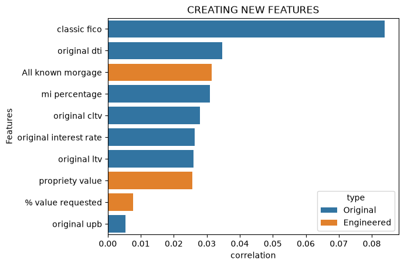

*`All_known_morgage` (orange) lands third overall, ahead of MI percentage, CLTV
and every remaining original feature, and `propriety_value` ranks mid-table.
`% value requested` sits near the bottom and was dropped. Only FICO and DTI beat
the engineered pair.*

## Redundancy between features

- A correlation heatmap over the numerical features shows the expected tight
  block: `original_ltv`, `original_cltv` and `mi_percentage` all measure
  leverage and move together. Tree models tolerate this, but it explains why
  feature selection later keeps only some of them.

  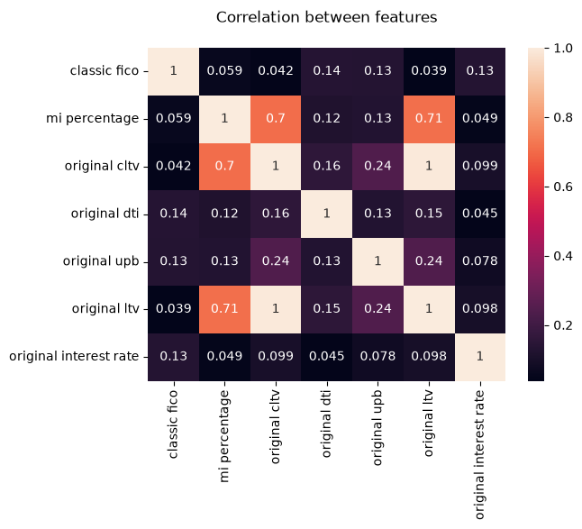

  *`original_ltv` and `original_cltv` correlate at **1.00** — they are the same
  variable for any loan without a junior lien — and both sit at 0.70/0.71 with
  MI percentage. RFE later keeps CLTV and discards LTV and MI, exactly as this
  predicts.*
- A mutual-information heatmap over the three geographic fields
  (`postal_code`, `msa_or_metropolitan_division`, `property_state`) confirms
  they are largely nested descriptions of the same thing — which is why the
  pipeline also builds one combined location key rather than relying on three
  overlapping ones.

  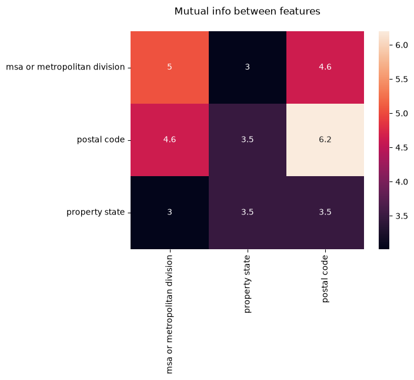

  *Postal code carries the most information (6.2 with itself), and its overlap
  with MSA (4.6) and state (3.5) shows how much of each is already contained in
  the others.*
