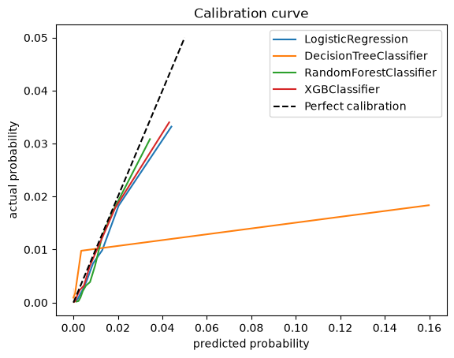

# 06 — Model selection

Four candidates, identical pipeline, fit on the training window and scored on
the validation quarter. Deliberately spanning model families rather than
tuning one: a linear baseline, a single tree, bagging, and boosting.

| | Baseline | Logistic Regression | Decision Tree | Random Forest | **XGBoost** |
|---|---|---|---|---|---|
| ROC-AUC | 0.5000 | 0.8207 | 0.5804 | 0.8055 | **0.8265** |
| Average Precision | 0.0078 | 0.0334 | 0.0120 | 0.0286 | **0.0354** |
| Brier Score | 0.4982 | 0.0077 | 0.0207 | 0.0077 | **0.0077** |

Baseline = random ranking: AUC 0.5, average precision equal to the base rate.

Configurations: `LogisticRegression(max_iter=3000)`;
`DecisionTreeClassifier(max_depth=20)`;
`RandomForestClassifier(n_estimators=200, max_depth=10)`;
`XGBClassifier(n_estimators=100, learning_rate=0.1, max_depth=3, eval_metric="auc")`.

## Reading the table

**Average precision is the decisive column.** With a 0.78% base rate, AP is the
metric that reflects how well positives are concentrated at the top of the
ranking, which is what a screening model is for. XGBoost wins at 0.0354 —
**4.5x the base rate** — with logistic regression a close second at 0.0334.

**The single decision tree fails**, and instructively. Its ROC-AUC of 0.58 is
barely better than chance and its Brier score (0.0207) is nearly three times
worse than the others. At `max_depth=20` on data with 129 negatives per
positive, leaves end up pure but tiny, so it emits near-0/near-1 probabilities
that are mostly wrong. The two ensembles built from trees do fine; the lone
tree is the problem, not the tree family.

**Logistic regression performing this well is worth noting.** The gap to
XGBoost is small, which says much of the signal here is close to monotone —
lower FICO, higher leverage, higher risk. XGBoost's edge comes from
interactions and thresholds on top of that.

**Brier scores cluster at 0.0077** for everything except the decision tree, but
that number mostly reflects the base rate: predicting 0.0077 for every loan
scores about as well. Brier alone cannot separate these models, which is why
the calibration curve is inspected too.

## Calibration

`calibration_curve(..., n_bins=10, strategy="quantile")` plots predicted against
observed default rates, with quantile bins because uniform bins would put
almost every loan in the first one.

- **XGBoost and Random Forest** track the diagonal closely across the range.
- **Logistic regression** is systematically over-predicting: its lowest bucket
  predicts 0.047% where 0.024% is observed, roughly double throughout the low
  range.
- **The decision tree** is erratic — one bucket predicts 16% and observes 1.8%.

*XGBoost (red) and Random Forest (green) hug the diagonal. Logistic regression
(blue) tracks it closely too but drifts above at the top end. The decision tree
(orange) is the flat line running out to a predicted 16% where observed risk is
under 2% — badly overconfident, and unusable for anything that needs a
probability rather than a rank.*

This matters beyond ranking. The dashboard shows a *probability of default* per
loan, not just a rank, so predictions that can be read as probabilities are part
of the requirement. XGBoost wins on both counts and is carried forward.
