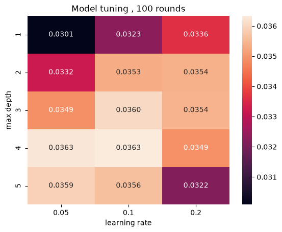

# 07 — Feature selection and tuning

Both steps are judged on **average precision on the validation quarter**, and
both run inside the full pipeline, so encoding and imputation are re-fitted for
every candidate configuration rather than shared across them.

## How many features?

After encoding, the design matrix has **61 columns**. Recursive Feature
Elimination (`RFE`, `step=1`) is swept over **8 to 15 features**, each count
scored by validation average precision.

The estimator driving RFE is a deliberately shallow
`XGBClassifier(max_depth=2, n_estimators=100, learning_rate=0.1)`. Using a
weaker model to rank features keeps the selection from being tailored to one
specific tuned configuration, and keeps 8 pipeline fits affordable.

Performance is flat across the range — with a 0.774% base rate there is only so
much signal to find, and the last few features add little. **10 features** was
chosen: at the plateau, and small enough to keep SHAP explanations readable in
the dashboard, which was an explicit goal.

## The 10 selected features

| Encoded name | Original field |
|---|---|
| `numerical__classic_fico` | FICO score at origination |
| `numerical__original_cltv` | Combined loan-to-value |
| `numerical__original_dti` | Debt-to-income ratio |
| `numerical__original_upb` | Original unpaid principal balance |
| `numerical__original_interest_rate` | Note rate |
| `categorical one hot__loan_purpose_P` | Purchase (vs refinance) |
| `categorical one hot__number_of_borrowers_1` | Single borrower |
| `catgorical target__msa_or_metropolitan_division` | Metro area, target-encoded |
| `catgorical target__property_state` | State, target-encoded |
| `catgorical target__position_combined` | ZIP + MSA + state key, target-encoded |

Three observations:

- **Five of the seven numerical features survive**; `original_ltv` and
  `mi_percentage` are eliminated, which is the expected consequence of their
  near-duplication with `original_cltv`.
- **Geography takes three of ten slots**, all target-encoded. The engineered
  `position_combined` key is retained alongside MSA and state, so the effort
  spent building it paid off.
- **Of 13 one-hot fields, only two levels survive**: purchase loans and single
  borrowers. Most categorical detail adds nothing once credit, leverage and
  location are known.

## Hyperparameter tuning

A grid over `learning_rate` x `max_depth` at 100 boosting rounds, scored on
validation average precision:



| AP | lr 0.05 | lr 0.1 | lr 0.2 |
|---|---|---|---|
| depth 1 | 0.0301 | 0.0323 | 0.0336 |
| depth 2 | 0.0332 | 0.0353 | 0.0354 |
| depth 3 | 0.0349 | **0.0360** | 0.0354 |
| **depth 4** | **0.0363** | **0.0363** | 0.0349 |
| depth 5 | 0.0359 | 0.0356 | 0.0322 |

Reading the grid:

- **Depth matters more than learning rate.** Moving from depth 1 to depth 4 buys
  about 0.006 AP; changing the learning rate at fixed depth moves it by 0.002 at
  most. Depth 1 means stumps — no interactions at all — and the gain from
  allowing them is the clearest signal in the table.
- **Depth 4 is the ceiling.** Depth 5 is worse at every learning rate, so the
  model starts fitting noise past four levels. With 7,916 positives, that is
  about where you would expect it.
- **The best cell is a tie** (0.0363 at lr 0.05 and lr 0.1, depth 4). **0.1 was
  taken** — same score, half the boosting rounds' worth of work.
- A second sweep over `min_child_weight` (1–5, at depth 4) settled on **1**.
  That parameter sets the minimum weight per leaf, and with positives this rare
  a higher value prunes away the small high-risk pockets the model exists to
  find.

`n_estimators` stayed at 100: with AP flat across the top of the grid, a longer
fit had nothing to buy.

Final configuration:

```python
XGBClassifier(
    n_estimators=100,
    learning_rate=0.1,
    max_depth=4,
    min_child_weight=1,
    eval_metric="auc",
    random_state=42,
    n_jobs=-1,
)
```

No `scale_pos_weight` and no resampling. The imbalance is handled by choosing
the right metrics and by tuning the decision threshold afterwards, which keeps
the output probabilities calibrated — reweighting would have distorted them, and
calibrated probabilities are needed for the dashboard. See
[11](11-limitations.md) for the trade-off.
