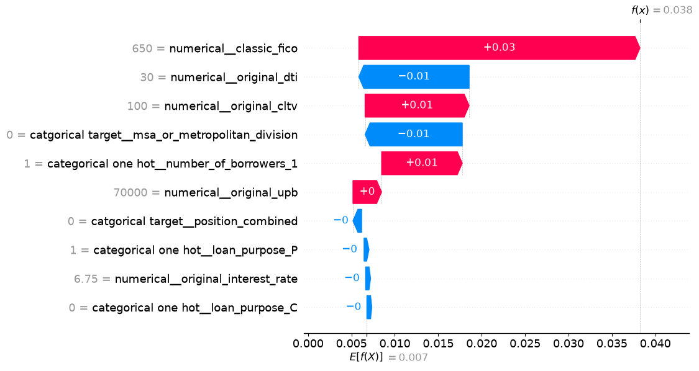

# 09 — Explainability

A credit model that cannot say *why* it flagged a loan is not usable: an
underwriter needs a reason, and in most jurisdictions an applicant is entitled to
one. Two complementary views are produced — global (which features matter across
the book) and local (why this loan, specifically).

## Permutation importance — global view

Each feature's values are shuffled and the drop in **average precision** is
measured (`n_repeats=10`). Average precision rather than accuracy, for the
reasons in [08](08-final-model-and-threshold.md).

| Feature | Importance | Std |
|---|---|---|
| `classic_fico` | **0.0562** | 0.0014 |
| `original_interest_rate` | 0.0208 | 0.0022 |
| `number_of_borrowers` | 0.0207 | 0.0015 |
| `original_upb` | 0.0202 | 0.0024 |
| `original_cltv` | 0.0195 | 0.0017 |
| `original_dti` | 0.0189 | 0.0022 |
| `property_state` | 0.0160 | 0.0014 |
| `msa_or_metropolitan_division` | 0.0138 | 0.0011 |
| `loan_purpose` | 0.0092 | 0.0014 |
| `postal_code` | 0.0090 | 0.0005 |
| `channel` | 0.0052 | 0.0011 |
| `seller_name` | 0.0038 | 0.0016 |
| remaining features | < 0.002 | |


*The gap between FICO and everything else is the whole story of this chart.*

**FICO is worth more than the next three features combined** — a 0.056 drop in
average precision against a baseline AP of 0.032, meaning that shuffling it
destroys the model's usefulness outright. Credit history dominates everything
else available at origination.

Then a cluster of loan-economics features at roughly equal weight: rate, size,
leverage, DTI. Note that `original_interest_rate` ranks so high partly because
it is *priced* — the rate a borrower receives already encodes the lender's own
risk assessment, so it works as a proxy for information not otherwise in the
file.

**Geography contributes meaningfully** — state, MSA and ZIP together rank above
DTI, which retrospectively justifies both the target encoding and the engineered
`position_combined` key.

`first_time_homebuyer_indicator` comes out slightly *negative* (-0.0009):
shuffling it improves the score marginally, i.e. it contributes noise. Standard
for a feature with no signal, and a reason it does not survive RFE.

Two caveats on this table. The pipeline used here is fit on the test set itself
and omits the RFE step, so these are in-sample importances for the full
61-feature model rather than for the deployed 10-feature one — read them as a
map of where the signal lives, not as a measure of the final model's
generalisation. And `target_90plus` appears with importance 0.0000 because the
target column is still carried inside `X_test`; it is not a feature (see
[04](04-validation-framework.md)).

## SHAP — local view

Two SHAP passes, for two different purposes.

**1. Single-loan explanation.** A `PermutationExplainer` wrapped around the
final model's `predict_proba`, with a 200-row background sample from the
training data as the masker. Force and waterfall plots then show how one loan's
predicted probability is built up from the base rate — which features pushed it
up, which pulled it down, and by how much. This is the format an underwriter
would actually be shown.



*One loan, read bottom to top. It starts at the model's base rate of 0.7% and
ends at **3.8%** — roughly five times average risk. A FICO of 650 alone adds
**+3 points**; CLTV of 100 and being a single borrower add a further point each;
a DTI of 30 and the MSA pull back about a point between them. Every bar is a
sentence an underwriter can actually use.*

**2. Whole-test-set attribution for the dashboard.** `TreeExplainer` on the
XGBoost model directly, which is exact and fast enough for every test loan.

The second pass includes an **additivity check** worth highlighting:

```python
reconstructed = 1 / (1 + np.exp(-(base_value + shap_values.sum(axis=1))))
np.allclose(reconstructed, proba, atol=1e-4)   # -> True
```

Base value plus the SHAP contributions, passed through the logistic function,
reproduces the model's own predicted probability. That is the guarantee that the
explanation describes the actual model and not an approximation of it.

## Mapping contributions back to real features

SHAP values come out per *encoded* column — `categorical one hot__loan_purpose_P`,
`catgorical target__property_state` — which is not what a business user wants to
read. A mapping matrix collapses them: each encoded name is traced back to the
original field by stripping the transformer prefix and matching the longest
original column name, then contributions are summed per original feature. Since
SHAP values are additive, summing across an encoding's columns is legitimate and
loses nothing.

The result is one SHAP value per *loan* per *original feature*.

## Exports that feed the dashboard

| File | Shape | Contents |
|---|---|---|
| `shap_long.parquet` | 1,324,314 rows x 5 | Long format: `loan_identifier`, `feature`, `shap_value`, `feature_value_num`, `feature_value_text` |
| `shap_loans.csv` | one row per test loan | `loan_identifier`, `predicted_pd`, `base_value` |


Long format is a deliberate choice for Power BI: with one row per loan-feature
pair, slicers and visuals can filter by feature without any DAX unpivoting, and
both the numeric and the text form of each feature value are available for
axes and tooltips respectively. Both files are excluded from the repository —
they are regenerated by the last cells of the notebook. See
[10](10-dashboard.md).
