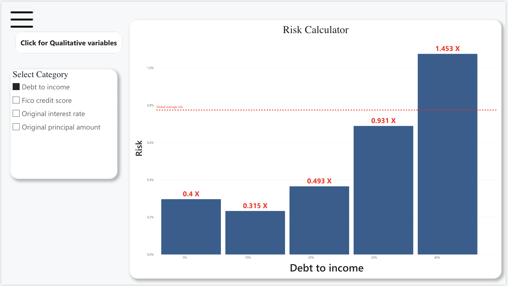
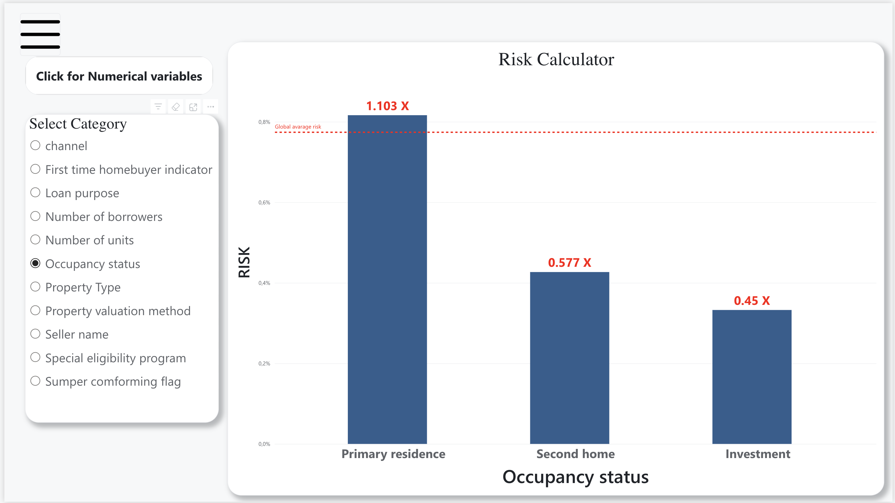
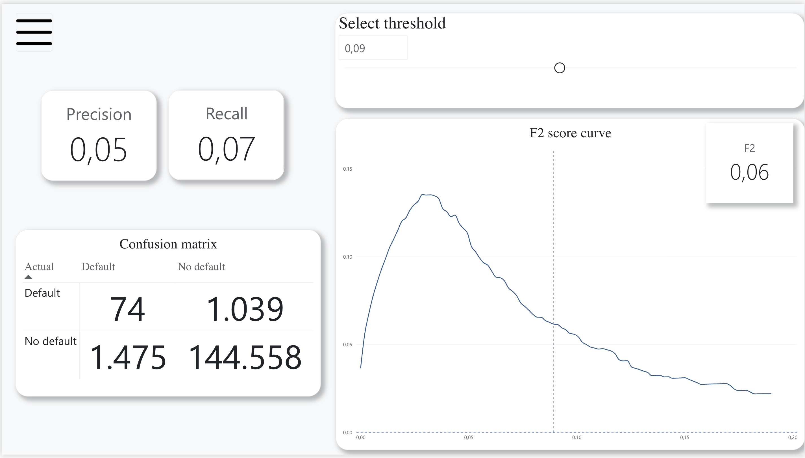
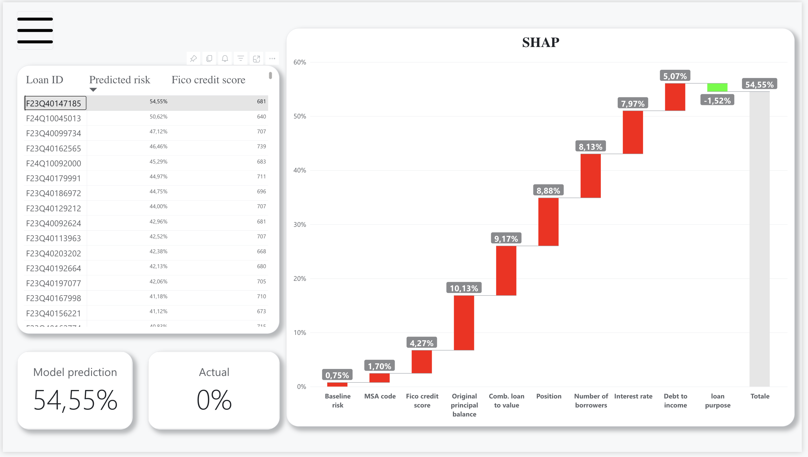

# 10 — Power BI dashboard

The model's output is delivered as an interactive Power BI report rather than as
notebook plots, so that a non-technical reader can work through the portfolio
loan by loan.

## Page 1 — Portfolio overview

The headline row states the book and the model in six numbers: **1.02 million
loans**, **319 billion** of exposure, average FICO **749.3**, actual default rate
**0.77%** against a model-predicted **0.79%**.

That last pair is the most important thing on the page. Predicted and actual
risk agreeing to within two hundredths of a percentage point is the calibration
result from [08](08-final-model-and-threshold.md) (Brier 0.007568 against a
prevalence of 0.007564) shown where a business reader will actually see it. It
is what licenses reading the rest of the report's percentages as real
probabilities.

Below it: risk by state on a choropleth, a **risk trend** line across origination
months, and the loan-purpose split — **84.73% purchase**, 11.38% cash-out
refinance, 3.89% no-cash-out refinance. Worth pairing with the EDA in
[03](03-eda.md): cash-out refinances are only an eighth of the book but run at
1.7x average risk.

## Pages 2 and 3 — Risk calculator

| | |
|---|---|
|  |  |

The EDA risk-ratio analysis, turned into something a user can drive. Pick a
variable and the chart shows risk by band against the global average line, with
the multiplier called out on each bar.

- **Numerical** (DTI, FICO, interest rate, principal amount): debt-to-income
  runs from **0.4x** below 10% to **1.45x** above 40%.
- **Categorical** (11 fields, from channel to seller name): occupancy status
  shows primary residences at **1.10x** against second homes at 0.58x and
  investment properties at **0.45x**.

Splitting the selector into qualitative and quantitative pages is the right call
— the two need different chart shapes, and one combined dropdown of 15 fields
would have been worse than two of seven.

## Page 4 — Threshold explorer

The threshold analysis from [08](08-final-model-and-threshold.md), made
interactive: a slider sets the cut-off and the precision, recall, F2 and
confusion matrix all recompute live, with the F2 curve marking where you are on
it.

The screenshot sits at **0.09** — well above the F2-optimal 0.0285 — and shows
what that costs: 74 defaults caught against 1,039 missed, recall down at 0.07.
Slide back toward 0.03 and the matrix moves to the 484/629 split reported in
[08](08-final-model-and-threshold.md).

This page is the argument that the threshold is a business decision rather than
a model constant. Anyone who thinks the review queue is too large can move the
slider and watch what it does to the defaults that slip through.

## Pages 5 and 6 — Loan-level explanation

| | |
|---|---|
|  |  |

The per-loan view: pick a loan ID and see its predicted probability decomposed
into a waterfall, starting from the **0.75% baseline risk** and ending at the
model's prediction, with every feature's contribution in percentage points and
the real outcome shown alongside.

The two examples are worth comparing. Loan `F23Q40000618` lands at **1.66%** —
a credit score pushing it up 1.99 points, offset by a DTI, loan purpose and
borrower count pulling it back down. Loan `F23Q40147185` lands at **54.55%**,
built from a stack of adverse contributions: MSA, a FICO of 681, principal
balance, CLTV, position, borrower count, rate and DTI all pushing the same way.

Both actually ended up performing. That is not a flaw in the display — it is the
base rate being honest. Even in the riskiest bucket the model can find, roughly
half of the loans still pay, and showing the actual outcome next to the
prediction keeps that visible rather than hiding it.

The right-hand page adds the ranking table — every loan sorted by predicted
risk, with FICO alongside — which is the screening workflow itself: start at the
top and work down.

## Why the `.pbix` is not in this repository

The file is roughly **99 MB**, because Power BI embeds a compressed copy of the
data model inside it. GitHub warns above 50 MB and refuses anything over 100 MB,
and committing a binary that size would bloat every clone permanently — a
`.pbix` cannot be diffed or merged, so each saved version would be stored again
in full. The screenshots above and the demo GIF carry the same information at a
fraction of the weight.

If it ever needs versioning, use Git LFS (`git lfs track "*.pbix"`) as a
deliberate step. `.gitignore` currently excludes `*.pbix`.

## Reproducing the report

1. Run `final_model.ipynb` end to end. The last cells write **`shap_long.parquet`**
   and **`shap_loans.csv`** into the project root (schemas in
   [09](09-explainability.md)).
2. In Power BI Desktop, load both: `shap_loans` as the loan-level table,
   `shap_long` as the attribution table, related on `loan_identifier`
   (one-to-many).
3. The long format is what makes the per-loan waterfalls possible without any
   DAX unpivoting — one row per loan-feature pair, with both the numeric and the
   text form of each feature value available for axes and tooltips.
